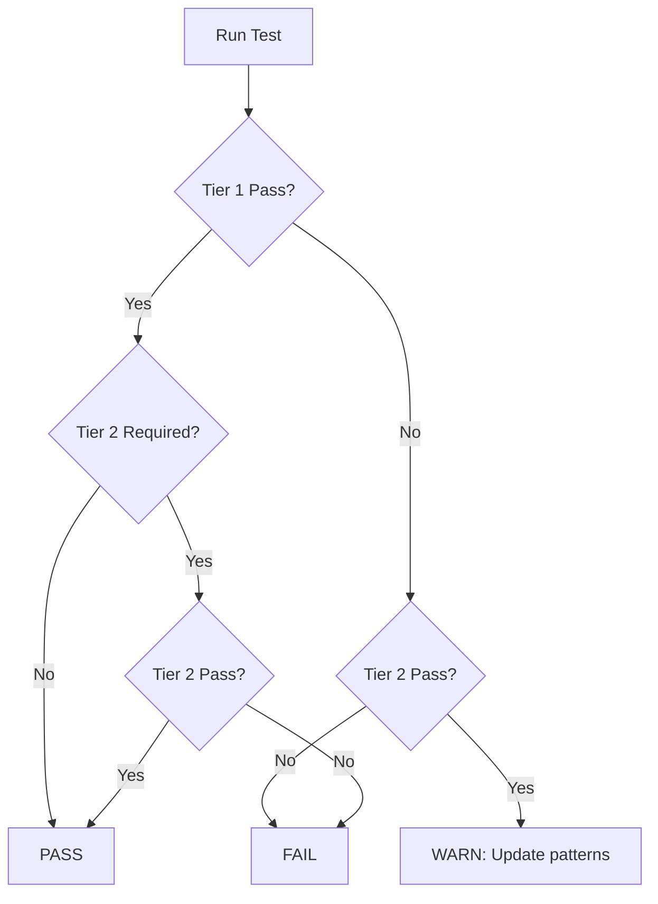

# MCP-AQL Conformance Testing Specification

**Version:** 1.0.0-draft
**Status:** Draft
**Last Updated:** 2026-04-15
> **Document Status:** This document is an **informative conformance framework specification** aligned to the normative protocol requirements in `docs/versions/v1.0.0-draft.md`.
>
> **Implementation Status:** The full `mcpaql-conformance` runner defined here is not yet published in this repository. Current implemented checks are schema/example validation in `scripts/validate-schema-examples.mjs`.

## Abstract

This document specifies the conformance testing requirements for MCP-AQL implementations. It defines conformance levels, test categories, pass/fail criteria, and evaluation methodologies including LLM-based semantic evaluation.

---

## Table of Contents

1. [Introduction](#1-introduction)
2. [Conformance Levels](#2-conformance-levels)
3. [Test Categories](#3-test-categories)
4. [Test Requirements](#4-test-requirements)
5. [Evaluation Methodology](#5-evaluation-methodology)
6. [Reporting](#6-reporting)
7. [Command-Line Interface](#7-command-line-interface)

---

## 1. Introduction

### 1.1 Purpose

MCP-AQL conformance testing ensures implementations meet the protocol specification and provide consistent, discoverable APIs for LLM interaction. This specification defines:

- What implementations MUST test
- How to evaluate test results
- How to report conformance levels

### 1.2 Terminology

The key words "MUST", "MUST NOT", "REQUIRED", "SHALL", "SHALL NOT", "SHOULD", "SHOULD NOT", "RECOMMENDED", "MAY", and "OPTIONAL" in this document are to be interpreted as described in [RFC 2119](https://www.rfc-editor.org/rfc/rfc2119).

### 1.3 Test Result Classifications

| Result | Meaning |
|--------|---------|
| **PASS** | Test criteria fully satisfied |
| **FAIL** | Test criteria not met, conformance blocked |
| **WARN** | Test criteria partially met, conformance not blocked |
| **SKIP** | Test not applicable to this implementation |

---

## 2. Conformance Levels

### 2.1 Level 1: Basic Conformance

Level 1 conformance establishes the minimum viable MCP-AQL implementation.

**Requirements:**

| Requirement | Description |
|-------------|-------------|
| Introspect (operations) | `introspect` operation with `query: "operations"` implemented |
| Introspect (types) | `introspect` operation with `query: "types"` implemented |
| Endpoint routing | Operations routed to the correct documented semantic endpoint family in semantic endpoint mode |
| Response format | Discriminated union responses (`{ success, data }` or `{ success, error }`) |
| Error handling | Structured error responses with code and message |
| Parameter naming | snake_case parameter naming convention |

**Test Categories Required:**
- Introspection Fidelity (MUST PASS)
- Parameter Handling (MUST PASS)
- Error Quality (MUST PASS)
- Round-Trip Integrity (MUST PASS)

### 2.2 Level 2: Full Conformance

Level 2 conformance indicates a complete MCP-AQL implementation with all optional features.

**Requirements:**

| Requirement | Description |
|-------------|-------------|
| Level 1 | All Level 1 requirements |
| Endpoint modes | Semantic endpoint mode and Single mode supported |
| Field selection | `fields` parameter on READ operations, with preset-name support documented where implemented |
| Batch operations | Multi-operation batching with individual results |
| Cross-cutting params | Consistent documentation for collection-query controls such as `query`, `filter`, pagination, field selection, and sorting |

**Test Categories Required:**
- All Level 1 test categories
- Constraint Documentation (SHOULD PASS)
- Semantic Evaluation (SHOULD PASS)

### 2.3 Conformance Certification

Implementations MAY claim conformance levels as follows:

```
MCP-AQL Level 1 Conformant
MCP-AQL Level 2 Conformant
```

Claims MUST include the specification version tested against.

---

## 3. Test Categories

### 3.1 Introspection Fidelity Tests (MUST PASS)

Verifies that introspection accurately describes the implementation.

```
TEST: Introspection Parameter Accuracy
  FOR EACH operation in introspection response:
    1. Extract parameter names and types
    2. Construct a valid request using ONLY introspection guidance
    3. Verify the request succeeds OR fails with a documented error

  PASS: All documented parameters work as described
  FAIL: Following introspection exactly produces unexpected errors
```

```
TEST: Introspection Completeness
  FOR EACH operation in implementation:
    1. Get documented parameters from introspection
    2. Attempt operation with each documented parameter
    3. Attempt operation with known cross-cutting parameters
    4. Compare accepted vs documented parameters

  PASS: All accepted parameters appear in introspection
  FAIL: Operation accepts parameters not in introspection
  WARN: Introspection documents parameters not accepted
```

### 3.2 Parameter Handling Tests (MUST PASS)

Verifies consistent parameter behavior.

```
TEST: Required Parameter Enforcement
  FOR EACH operation with required parameters:
    1. Omit each required parameter in turn
    2. Verify operation fails with clear error

  PASS: Missing required params produce "missing parameter" errors
  FAIL: Operation succeeds without required parameter
  FAIL: Error message does not identify the missing parameter
```

```
TEST: Unknown Parameter Handling
  FOR EACH operation:
    1. Send valid request with one additional unknown parameter
    2. Verify server either:
       a) Accepts request (param ignored with optional warning), OR
       b) Rejects with clear "unknown parameter" error

  PASS: Behavior is explicit (warning OR error)
  FAIL: Unknown parameters silently ignored with no indication
```

```
TEST: Optional Parameter Defaults
  FOR EACH optional parameter with documented default:
    1. Send request without the parameter
    2. Verify response reflects documented default behavior

  PASS: Defaults applied as documented
  FAIL: Behavior differs from documented default
```

### 3.3 Error Quality Tests (MUST PASS)

Verifies error messages are user-appropriate.

```
TEST: No Implementation Leakage
  FOR EACH error condition:
    1. Trigger the error
    2. Verify error message does NOT contain:
       - Programming language artifacts (TypeError, #<Object>, .js:, .ts:)
       - Stack traces (at Function, at Module)
       - Internal paths (/src/, /node_modules/)

  PASS: Error messages are implementation-agnostic
  FAIL: Raw implementation errors exposed
```

```
TEST: Actionable Error Messages
  FOR EACH validation error:
    1. Trigger the error
    2. Verify error message includes:
       - What went wrong
       - Which parameter/field is affected
       - Expected type or format (for type errors)

  PASS: Error messages enable self-correction
  WARN: Error messages lack actionable guidance
```

**Recommended Error Format:**
```
Missing required parameter '{paramName}'. Expected: {type} ({description})
```

### 3.4 Round-Trip Integrity Tests (MUST PASS)

Verifies data consistency through create-read cycles.

```
TEST: Create-Read Consistency
  FOR EACH element type:
    1. Create element with all documented optional fields
    2. Read element back via get operation
    3. Compare all fields

  PASS: All submitted fields present and unchanged
  FAIL: Data silently dropped during create
  FAIL: Field values modified unexpectedly
```

```
TEST: Update Preservation
  FOR EACH element type:
    1. Create element with initial values
    2. Update subset of fields
    3. Read element back
    4. Verify non-updated fields unchanged

  PASS: Unmodified fields preserved
  FAIL: Update operation affects non-targeted fields
```

### 3.5 Constraint Documentation Tests (SHOULD PASS)

Verifies element-specific constraints are discoverable.

```
TEST: Read-Only Field Protection
  FOR EACH element type with read-only fields:
    1. Attempt to update a read-only field
    2. Verify operation fails with constraint error
    3. Verify introspection documents the constraint

  PASS: Constraint enforced AND documented
  WARN: Constraint enforced but not in introspection
  FAIL: Read-only field can be modified
```

```
TEST: Append-Only Semantics
  FOR EACH append-only data type (e.g., Memory entries):
    1. Verify content cannot be modified via update
    2. Verify error message explains append-only behavior
    3. Verify introspection documents the constraint

  PASS: Append-only enforced AND documented
  WARN: Enforced but not documented
```

---

## 4. Test Requirements

### 4.1 MUST PASS Requirements

The following test categories MUST pass for Level 1 conformance:

| Category | Tests | Rationale |
|----------|-------|-----------|
| Introspection Fidelity | 2 | LLMs must trust introspection |
| Parameter Handling | 3 | Consistent behavior across operations |
| Error Quality | 2 | Usable error messages |
| Round-Trip Integrity | 2 | Data consistency guarantee |

**Total MUST PASS tests:** 9

### 4.2 SHOULD PASS Requirements

The following test categories SHOULD pass for Level 2 conformance:

| Category | Tests | Rationale |
|----------|-------|-----------|
| Constraint Documentation | 2 | Discoverable constraints |
| Semantic Evaluation | Per implementation | LLM discoverability |

**Failure in SHOULD PASS tests:** Produces WARN, does not block conformance

---

## 5. Evaluation Methodology

### 5.1 Two-Tier Evaluation Approach

Conformance tests SHOULD use a two-tier evaluation approach:

#### Tier 1: Structural Validation (Fast, Deterministic)

- Pattern matching for expected response elements
- JSON schema validation for response structure
- Presence checks for required fields
- Regex validation for error message patterns

**Characteristics:**
- Fast execution
- Deterministic results
- Catches obvious failures

#### Tier 2: Semantic Validation (Comprehensive, AI-Assisted)

- LLM evaluation of response correctness
- Semantic similarity scoring
- Intent classification for operation selection
- Natural language understanding of guidance

**Characteristics:**
- Comprehensive coverage
- Handles natural language variation
- Catches subtle usability issues

### 5.2 Semantic Evaluation Requirements

Tests for LLM discoverability SHOULD use semantic evaluation:

```
TEST: API Discoverability
  1. Prompt LLM with discovery task
  2. Capture LLM response and tool calls
  3. Tier 1: Check for expected patterns (fast fail)
  4. Tier 2: If Tier 1 inconclusive, evaluate semantic correctness
  5. Report both structural and semantic results

  PASS: Tier 1 passes AND Tier 2 confirms understanding
  WARN: Tier 1 fails but Tier 2 passes (potential pattern update needed)
  FAIL: Both tiers fail OR Tier 1 passes but Tier 2 fails
```

### 5.3 Test Categories Requiring Semantic Evaluation

| Category | Example Prompt | Why Semantic Matters |
|----------|----------------|---------------------|
| Introspection Discovery | "List available operations" | LLM may describe operations differently |
| Field Selection Discovery | "Does search support field selection?" | Affirmative answer may use varied phrasing |
| Error Understanding | "Handle this error gracefully" | Recovery strategies may vary |
| Operation Selection | "Create an element" | Correct tool choice matters more than exact call format |

### 5.4 Evaluation Workflow



---

## 6. Reporting

### 6.1 Conformance Report Format

Implementations SHOULD generate conformance reports:

```json
{
  "implementation": "example-adapter",
  "version": "1.0.0",
  "specVersion": "1.0.0-draft",
  "testDate": "2026-01-29T00:00:00Z",
  "conformanceLevel": 1,
  "summary": {
    "total": 11,
    "passed": 9,
    "warned": 2,
    "failed": 0,
    "skipped": 0
  },
  "categories": [
    {
      "name": "Introspection Fidelity",
      "required": "MUST",
      "result": "PASS",
      "tests": [
        { "name": "Parameter Accuracy", "result": "PASS" },
        { "name": "Completeness", "result": "PASS" }
      ]
    }
  ]
}
```

### 6.2 Badge Format

Conformant implementations MAY display badges:

```markdown


```

### 6.3 Certification Registry

A future certification registry MAY track conformant implementations.

---

## 7. Command-Line Interface

### 7.1 CLI Invocation

Conformance test runners SHOULD provide a command-line interface:

```bash
mcpaql-conformance <command> [options]
```

### 7.2 Commands

| Command | Description | Example |
|---------|-------------|---------|
| `test` | Run conformance tests against an adapter | `mcpaql-conformance test ./adapter` |
| `report` | Generate formatted report from test results file | `mcpaql-conformance report ./results.json` |
| `version` | Print tool version | `mcpaql-conformance version` |

**Note:** The `report` command takes a JSON results file (produced by `test --format json --output results.json`) as input and generates human-readable or markdown output.

### 7.3 Test Command Options

| Option | Description | Default |
|--------|-------------|---------|
| `--level`, `-l` | Conformance level to test (1 or 2) | `1` |
| `--output`, `-o` | Output file for results | stdout |
| `--format`, `-f` | Output format (`json`, `text`, `markdown`) | `text` |
| `--verbose`, `-v` | Enable verbose output | `false` |
| `--tier` | Evaluation tier (`1`, `2`, `both`) | `both` |
| `--category`, `-c` | Run specific test category only | All |
| `--timeout` | Test timeout in seconds | `30` |

### 7.4 Exit Codes

| Code | Meaning | Description |
|------|---------|-------------|
| `0` | All tests passed | Conformance achieved at requested level |
| `1` | Tests failed | One or more MUST PASS tests failed |
| `2` | Tests warned | All MUST PASS passed, but SHOULD PASS tests warned |
| `3` | Configuration error | Invalid adapter path or configuration |
| `4` | Timeout | Tests exceeded timeout limit |
| `5` | Internal error | Unexpected error in test runner |

### 7.5 Example Usage

**Run Level 1 conformance tests:**
```bash
mcpaql-conformance test ./generated-adapter --level 1
```

**Run Level 2 tests with JSON output:**
```bash
mcpaql-conformance test ./adapter --level 2 --format json --output results.json
```

**Run specific test category:**
```bash
mcpaql-conformance test ./adapter --category "Introspection Fidelity"
```

**Verbose output with Tier 2 semantic evaluation:**
```bash
mcpaql-conformance test ./adapter --level 2 --tier both --verbose
```

**Generate markdown report from results:**
```bash
mcpaql-conformance report ./results.json --format markdown > CONFORMANCE.md
```

### 7.6 Integration with Generator

The adapter generator (see [Adapter Generator Specification](adapter/generator.md)) SHOULD invoke conformance tests as part of the generation workflow:

```bash
# Generate adapter and run conformance tests
mcpaql-generate --schema adapter.yaml --target typescript --output ./adapter

# Test generated adapter
mcpaql-conformance test ./adapter --level 1
```

---

## References

- [MCP-AQL Specification v1.0.0-draft](versions/v1.0.0-draft.md)
- [Introspection Specification](introspection.md)
- [Operations Specification](operations.md)
- [GitHub Issue #10](https://github.com/MCPAQL/spec/issues/10) - Conformance test suite
- [GitHub Issue #55](https://github.com/MCPAQL/spec/issues/55) - Conformance test requirements
- [GitHub Issue #56](https://github.com/MCPAQL/spec/issues/56) - LLM semantic evaluation
