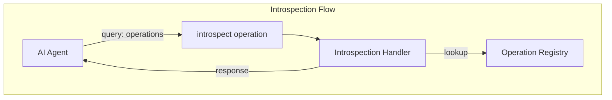
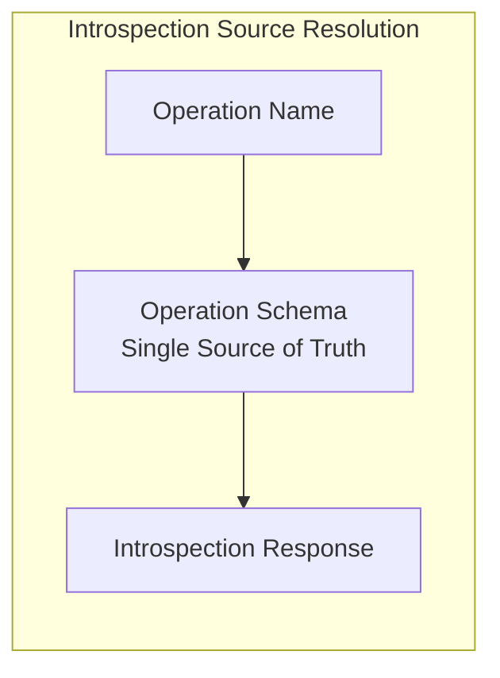
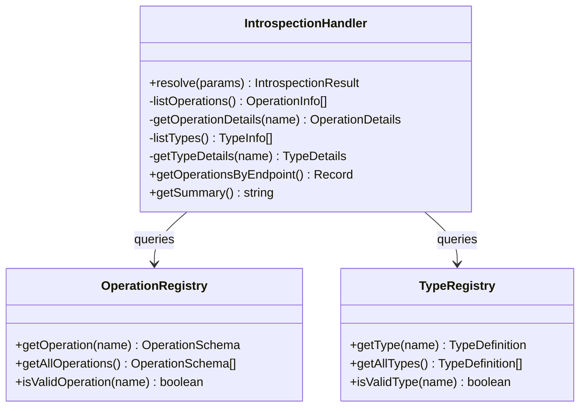

# MCP-AQL Introspection Specification

**Version:** 1.0.0-draft
**Status:** Draft
**Last Updated:** 2026-01-16

> **Document Status:** This document is **informative**. For normative requirements, see [MCP-AQL Specification v1.0.0](./versions/v1.0.0-draft.md).

## Abstract

This document specifies the MCP-AQL introspection system, which provides GraphQL-style discovery capabilities for operations, parameters, types, and examples at runtime. The introspection system is the only operation that MCP-AQL mandates all adapters implement, enabling AI models to discover capabilities dynamically.

## Table of Contents

1. [Introduction](#1-introduction)
2. [Introspection Query Types](#2-introspection-query-types)
3. [Response Structures](#3-response-structures)
4. [Operation Discovery](#4-operation-discovery)
5. [Type Discovery](#5-type-discovery)
6. [Implementation Guidance](#6-implementation-guidance)
7. [Token Efficiency](#7-token-efficiency)
8. [Conformance Requirements](#8-conformance-requirements)

---

## 1. Introduction

### 1.1 Purpose

The introspection system enables AI models to discover available operations at runtime rather than parsing large tool schemas upfront. This provides:

- **On-demand discovery** - Query only what is needed
- **Self-documenting API** - API describes itself without external documentation
- **Token efficiency** - Avoid parsing many tool schemas
- **Dynamic capability detection** - Discover adapter-specific operations

### 1.2 Design Principles

1. **Progressive disclosure** - Start with summaries, drill into details
2. **Consistency** - Same response structure for all queries
3. **Completeness** - Sufficient information to construct valid requests
4. **Efficiency** - Minimal response size while maintaining usefulness

### 1.3 Introspection Flow

The following diagram illustrates how an AI model discovers and uses operations:



### 1.4 Adapter-Defined Content

The introspection system returns information about the adapter's operations and types. Different adapters expose different operations - MCP-AQL defines the introspection mechanism, not the operations themselves.

---

## 2. Introspection Query Types

### 2.1 The `introspect` Operation

All introspection is performed through the `introspect` operation on the READ endpoint. This is the only operation that MCP-AQL REQUIRES all adapters to implement.

**Request Format:**
```javascript
{
  operation: "introspect",
  params: {
    query: "<query_type>",
    name: "<optional_specific_name>"
  }
}
```

### 2.2 Query Types

| Query | Description | Optional `name` Parameter |
|-------|-------------|---------------------------|
| `operations` | List all available operations | Get details for a specific operation |
| `types` | List all available types | Get details for a specific type |

### 2.3 Query Behavior

**Without `name` parameter:** Returns a list of all items of that type with summary information.

**With `name` parameter:** Returns detailed information for the specific item.

### 2.4 Basic Usage Examples

```javascript
// List all operations
{
  operation: "introspect",
  params: { query: "operations" }
}

// Get details for a specific operation
{
  operation: "introspect",
  params: { query: "operations", name: "create_entity" }
}

// List all types
{
  operation: "introspect",
  params: { query: "types" }
}

// Get details for a specific type
{
  operation: "introspect",
  params: { query: "types", name: "EntityType" }
}
```

---

## 3. Response Structures

### 3.1 Standard Response Wrapper

All introspection responses MUST follow the standard MCP-AQL discriminated response format:

```javascript
// Success response
{
  success: true,
  data: {
    // Introspection-specific payload
  }
}

// Failure response
{
  success: false,
  error: {
    code: "INTROSPECTION_ERROR",
    message: "Description of what went wrong"
  }
}
```

### 3.2 OperationInfo (List Item)

Summary information for an operation in list responses:

```typescript
interface OperationInfo {
  name: string;        // Operation identifier (e.g., "create_entity")
  endpoint: string;    // CRUDE endpoint (e.g., "CREATE")
  description: string; // Brief description
}
```

### 3.3 OperationDetails (Detail Response)

Complete information for a specific operation:

```typescript
interface OperationDetails {
  name: string;                    // Operation identifier
  endpoint: string;                // CRUDE endpoint
  mcpTool: string;                 // MCP tool name (e.g., "mcp_aql_create")
  description: string;             // Detailed description
  permissions: EndpointPermissions;
  parameters: ParameterInfo[];     // Parameter definitions
  returns: TypeInfo;               // Return type information
  examples: string[];              // Example invocations
}

interface EndpointPermissions {
  readOnly: boolean;    // Whether operation modifies state
  destructive: boolean; // Whether operation removes state
}
```

### 3.4 ParameterInfo

Parameter definition with optional constraint metadata:

```typescript
interface ParameterInfo {
  // Core fields (required)
  name: string;        // Parameter name (snake_case recommended)
  type: string;        // Type name (e.g., "string", "number", "boolean", "array", "object")
  required: boolean;   // Whether parameter is required

  // Documentation (optional)
  description?: string; // Parameter description
  default?: unknown;    // Default value if any

  // Constraint fields (optional) - enable client-side validation and LLM guidance
  enum?: unknown[];     // Allowed values for this parameter
  minimum?: number;     // Minimum value for numeric parameters (inclusive)
  maximum?: number;     // Maximum value for numeric parameters (inclusive)
  minLength?: number;   // Minimum length for string parameters
  maxLength?: number;   // Maximum length for string parameters
  pattern?: string;     // Regex pattern for string validation
  format?: string;      // Semantic format hint (e.g., "date-time", "email", "uri", "uuid")
  items?: object;       // Schema for array element types (nested ParameterInfo)

  // Security (optional)
  sensitive?: boolean;  // Whether parameter contains sensitive data (passwords, API keys)
}
```

#### 3.4.1 Constraint Field Usage

Constraint fields are **the highest-value properties in the introspection system** - they prevent LLM hallucination by telling agents exactly what values are valid.

| Field | Type | Purpose |
|-------|------|---------|
| `enum` | array | Lists all valid values; LLM can select from these |
| `minimum`/`maximum` | number | Numeric bounds; LLM can generate values in range |
| `minLength`/`maxLength` | integer | String length limits |
| `pattern` | string | Regex pattern for validation |
| `format` | string | Semantic format hint (date-time, email, uri, uuid) |
| `items` | object | Element schema for array parameters |
| `sensitive` | boolean | Flag for passwords/API keys; clients SHOULD mask input |

**Example with constraints:**
```json
{
  "name": "page_size",
  "type": "integer",
  "required": false,
  "description": "Number of items per page",
  "default": 25,
  "minimum": 1,
  "maximum": 100
}
```

```json
{
  "name": "status",
  "type": "string",
  "required": true,
  "description": "Filter by status",
  "enum": ["pending", "active", "completed", "cancelled"]
}
```

```json
{
  "name": "api_key",
  "type": "string",
  "required": true,
  "description": "API key for authentication",
  "sensitive": true
}
```

### 3.5 TypeInfo (List Item)

Summary information for a type:

```typescript
interface TypeInfo {
  name: string;         // Type identifier
  kind: TypeKind;       // "enum" | "object" | "scalar" | "union"
  description?: string; // Brief description
}
```

### 3.6 TypeDetails (Detail Response)

Complete information for a specific type:

```typescript
interface TypeDetails extends TypeInfo {
  values?: string[];         // For enum types: allowed values
  fields?: ParameterInfo[];  // For object types: field definitions
  members?: string[];        // For union types: member type names
}
```

---

## 4. Operation Discovery

### 4.1 Listing All Operations

**Request:**
```javascript
{
  operation: "introspect",
  params: { query: "operations" }
}
```

**Response (example from a resource management adapter):**
```json
{
  "success": true,
  "data": {
    "operations": [
      {
        "name": "create_entity",
        "endpoint": "CREATE",
        "description": "Create a new entity"
      },
      {
        "name": "list_entities",
        "endpoint": "READ",
        "description": "List entities with filtering and pagination"
      },
      {
        "name": "get_entity",
        "endpoint": "READ",
        "description": "Get an entity by identifier"
      },
      {
        "name": "update_entity",
        "endpoint": "UPDATE",
        "description": "Update entity properties"
      },
      {
        "name": "delete_entity",
        "endpoint": "DELETE",
        "description": "Delete an entity"
      },
      {
        "name": "execute_workflow",
        "endpoint": "EXECUTE",
        "description": "Start execution of a workflow"
      },
      {
        "name": "introspect",
        "endpoint": "READ",
        "description": "Discover available operations and types"
      }
    ]
  }
}
```

### 4.2 Getting Operation Details

**Request:**
```javascript
{
  operation: "introspect",
  params: { query: "operations", name: "create_entity" }
}
```

**Response:**
```json
{
  "success": true,
  "data": {
    "operation": {
      "name": "create_entity",
      "endpoint": "CREATE",
      "mcpTool": "mcp_aql_create",
      "description": "Create a new entity of any type",
      "permissions": {
        "readOnly": false,
        "destructive": false
      },
      "parameters": [
        {
          "name": "entity_name",
          "type": "string",
          "required": true,
          "description": "Entity name",
          "minLength": 1,
          "maxLength": 100,
          "pattern": "^[a-zA-Z][a-zA-Z0-9_-]*$"
        },
        {
          "name": "entity_type",
          "type": "string",
          "required": true,
          "description": "Type of entity to create",
          "enum": ["resource", "item", "config", "workflow"]
        },
        {
          "name": "description",
          "type": "string",
          "required": true,
          "description": "Entity description",
          "maxLength": 500
        },
        {
          "name": "priority",
          "type": "integer",
          "required": false,
          "description": "Priority level",
          "default": 5,
          "minimum": 1,
          "maximum": 10
        },
        {
          "name": "metadata",
          "type": "object",
          "required": false,
          "description": "Additional metadata"
        }
      ],
      "returns": {
        "name": "Entity",
        "kind": "object",
        "description": "Newly created entity"
      },
      "examples": [
        "{ operation: \"create_entity\", element_type: \"resource\", params: { entity_name: \"MyResource\", description: \"A sample resource\" } }"
      ]
    }
  }
}
```

### 4.3 Unknown Operation

When querying for an operation that does not exist, implementations MUST return a success response with null data:

**Request:**
```javascript
{
  operation: "introspect",
  params: { query: "operations", name: "nonexistent_operation" }
}
```

**Response:**
```json
{
  "success": true,
  "data": {
    "operation": null
  }
}
```

---

## 5. Type Discovery

### 5.1 Listing All Types

**Request:**
```javascript
{
  operation: "introspect",
  params: { query: "types" }
}
```

**Response:**
```json
{
  "success": true,
  "data": {
    "types": [
      {
        "name": "EntityType",
        "kind": "enum",
        "description": "Available entity types"
      },
      {
        "name": "CRUDEndpoint",
        "kind": "enum",
        "description": "CRUDE endpoint categories for operation classification"
      },
      {
        "name": "OperationInput",
        "kind": "object",
        "description": "Standard input structure for all MCP-AQL operations"
      },
      {
        "name": "OperationResult",
        "kind": "union",
        "description": "Standard result type for all operations"
      },
      {
        "name": "OperationSuccess",
        "kind": "object",
        "description": "Successful operation result"
      },
      {
        "name": "OperationFailure",
        "kind": "object",
        "description": "Failed operation result"
      }
    ]
  }
}
```

### 5.2 Getting Type Details

#### 5.2.1 Enum Type

**Request:**
```javascript
{
  operation: "introspect",
  params: { query: "types", name: "EntityType" }
}
```

**Response:**
```json
{
  "success": true,
  "data": {
    "type": {
      "name": "EntityType",
      "kind": "enum",
      "description": "Available entity types",
      "values": ["resource", "item", "config", "workflow"]
    }
  }
}
```

#### 5.2.2 Object Type

**Request:**
```javascript
{
  operation: "introspect",
  params: { query: "types", name: "OperationInput" }
}
```

**Response:**
```json
{
  "success": true,
  "data": {
    "type": {
      "name": "OperationInput",
      "kind": "object",
      "description": "Standard input structure for all MCP-AQL operations",
      "fields": [
        {
          "name": "operation",
          "type": "string",
          "required": true,
          "description": "The operation to perform"
        },
        {
          "name": "element_type",
          "type": "string",
          "required": false,
          "description": "Element type for element operations"
        },
        {
          "name": "params",
          "type": "object",
          "required": false,
          "description": "Operation-specific parameters"
        }
      ]
    }
  }
}
```

#### 5.2.3 Union Type

**Request:**
```javascript
{
  operation: "introspect",
  params: { query: "types", name: "OperationResult" }
}
```

**Response:**
```json
{
  "success": true,
  "data": {
    "type": {
      "name": "OperationResult",
      "kind": "union",
      "description": "Standard result type for all operations",
      "members": ["OperationSuccess", "OperationFailure"]
    }
  }
}
```

### 5.3 Protocol Types

MCP-AQL defines these protocol-level types that adapters SHOULD include in their type registry:

| Type Name | Kind | Description |
|-----------|------|-------------|
| `CRUDEndpoint` | enum | Endpoints: CREATE, READ, UPDATE, DELETE, EXECUTE |
| `OperationInput` | object | Standard input structure |
| `OperationResult` | union | Success or failure result |
| `OperationSuccess` | object | Successful result with data |
| `OperationFailure` | object | Failed result with error |
| `EndpointPermissions` | object | Permission flags for operations |

Adapters define their own domain-specific types in addition to these.

---

## 6. Implementation Guidance

### 6.1 Schema-Driven Architecture

Implementations SHOULD maintain a single source of truth for operation definitions. The introspection system derives its responses from this source:



### 6.2 Introspection Handler Architecture

A conforming implementation typically includes these components:



### 6.3 Utility Methods

Implementations MAY provide utility methods for documentation and tooling:

**Operations by Endpoint:**
```typescript
// Returns operations grouped by CRUDE endpoint
getOperationsByEndpoint(): Record<CRUDEndpoint, OperationInfo[]>
```

**Summary Generation:**
```typescript
// Returns a human-readable summary of all operations
getSummary(): string

// Example output:
// MCP-AQL Operations:
//   CREATE: create_entity, import_entity
//   READ: list_entities, get_entity, introspect
//   UPDATE: update_entity
//   DELETE: delete_entity
//   EXECUTE: execute_workflow
//
// Types: EntityType, CRUDEndpoint, OperationInput, OperationResult
//
// Use introspect with name parameter for details.
```

---

## 7. Token Efficiency

### 7.1 Discovery Pattern

The introspection system enables a token-efficient discovery pattern:

```
Step 1: List operations (~50 tokens response)
   { operation: "introspect", params: { query: "operations" } }

Step 2: Get details for relevant operation (~100 tokens response)
   { operation: "introspect", params: { query: "operations", name: "create_entity" } }

Step 3: Execute operation
   { operation: "create_entity", params: { ... } }
```

### 7.2 Comparison with Discrete Tools

| Approach | Upfront Cost | Per-Operation Cost | Total (10 ops) |
|----------|--------------|-------------------|----------------|
| Discrete tools | ~29,600 tokens | 0 | ~29,600 |
| MCP-AQL + introspect | ~1,100 tokens | ~150 tokens | ~2,600 |

### 7.3 Caching Recommendations

Implementations SHOULD:
- Cache introspection responses during a session
- Return consistent results for the same query within a session
- Invalidate cache only when server configuration changes

---

## 8. Conformance Requirements

### 8.1 MUST Requirements

Conforming implementations MUST:

1. Implement the `introspect` operation on the READ endpoint
2. Support both `operations` and `types` query types
3. Return `OperationInfo` for all supported operations when listing
4. Return `OperationDetails` when querying a specific operation by name
5. Return `TypeInfo` for all supported types when listing
6. Return `TypeDetails` when querying a specific type by name
7. Include accurate parameter information with `required` flags
8. Use consistent type names across all responses
9. Return `null` for the item (not an error) when querying a non-existent operation or type
10. Follow the discriminated response format (`{ success, data }` or `{ success, error }`)

#### 8.1.1 Introspection Accuracy (MUST)

Introspection responses MUST accurately reflect the actual parameter names, types, and behaviors accepted by the implementation:

1. Parameter names in introspection MUST match the names expected by the operation handler
2. Parameter types in introspection MUST match the types accepted by the operation handler
3. Required/optional status in introspection MUST match the actual handler behavior

#### 8.1.2 Parameter Completeness (MUST)

For every operation, implementations MUST ensure introspection completeness:

1. Every parameter accepted by the handler implementation MUST appear in introspection metadata
2. Required parameters MUST appear with `required: true`
3. Optional parameters MUST appear with `required: false`
4. Feature parameters (e.g., `fields`, `limit`, `offset`) MUST appear with full type information

**Conformance Test:**
```
FOR EACH operation in introspection:
  1. Get documented parameters from introspection
  2. Attempt operation with each documented parameter
  3. Attempt operation with known cross-cutting parameters (fields, limit, offset)
  4. Compare accepted vs documented parameters

FAIL IF: Operation accepts parameters not in introspection
WARN IF: Introspection documents parameters not accepted
```

#### 8.1.3 Error Message Quality (MUST)

Error responses MUST NOT expose internal implementation details:

1. Error messages MUST NOT include programming language error messages
2. Error messages MUST NOT include stack traces
3. Error messages MUST NOT include internal class/object names or file paths

### 8.2 SHOULD Requirements

Conforming implementations SHOULD:

1. Include usage examples for all operations
2. Provide meaningful descriptions for all parameters
3. Document default values in parameter info
4. Return operations grouped by endpoint in list responses
5. Include the protocol types (`CRUDEndpoint`, `OperationResult`, etc.)
6. Implement caching for introspection responses
7. Include the `introspect` operation in the operations list
8. Derive introspection data from a single source of truth (operation schema)

#### 8.2.1 Unknown Parameter Handling (SHOULD)

Implementations SHOULD handle unrecognized parameters explicitly:

1. Accept parameters at documented locations, OR
2. Return a warning or error when unrecognized parameters are provided
3. Implementations SHOULD NOT silently ignore parameters

#### 8.2.2 Element-Type Constraints (SHOULD)

Introspection responses SHOULD document element-type-specific constraints:

1. Read-only or append-only fields SHOULD be documented
2. Required nesting (e.g., "tags must be in metadata.tags") SHOULD be documented
3. Operations that don't apply to certain element types SHOULD be noted

#### 8.2.3 Error Message Guidance (SHOULD)

Error responses SHOULD include actionable information:

1. A clear description of what went wrong
2. The correct action the user should take
3. Reference to the appropriate operation if applicable

**Recommended Error Message Format:**
```
Missing required parameter '{paramName}'. Expected: {type} ({description})
```

**Examples:**
```
Missing required parameter 'name'. Expected: string (the name of the memory to operate on)
Missing required parameter 'source'. Expected: string (URL or file path to import from)
```

#### 8.2.4 Deprecated Parameters (SHOULD)

1. Deprecated parameters SHOULD appear in introspection with a deprecation notice
2. Deprecated parameters SHOULD include migration guidance in the description

### 8.3 MAY Requirements

Conforming implementations MAY:

1. Define additional custom types
2. Include additional metadata in responses
3. Support additional query types beyond `operations` and `types`
4. Provide filtering/pagination for large operation lists
5. Include utility methods for documentation generation
6. Support field selection on introspection responses

---

## References

- [MCP-AQL Specification v1.0.0-draft](versions/v1.0.0-draft.md)
- [CRUDE Pattern Specification](crude-pattern.md)
- [Operations Guide](operations.md)
