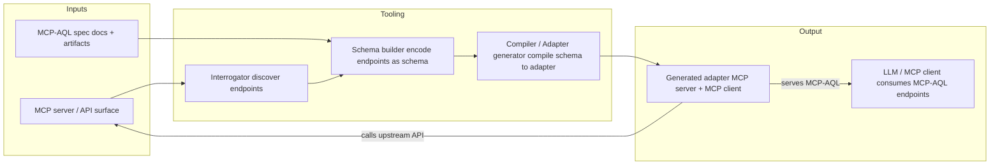
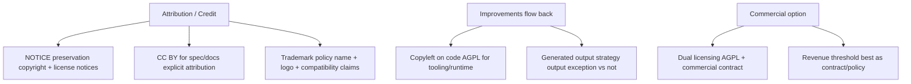
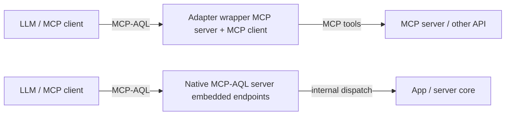
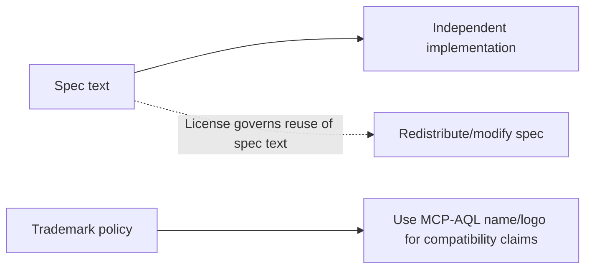
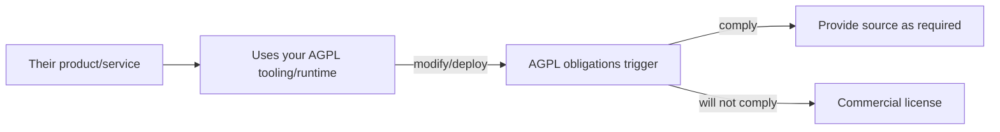
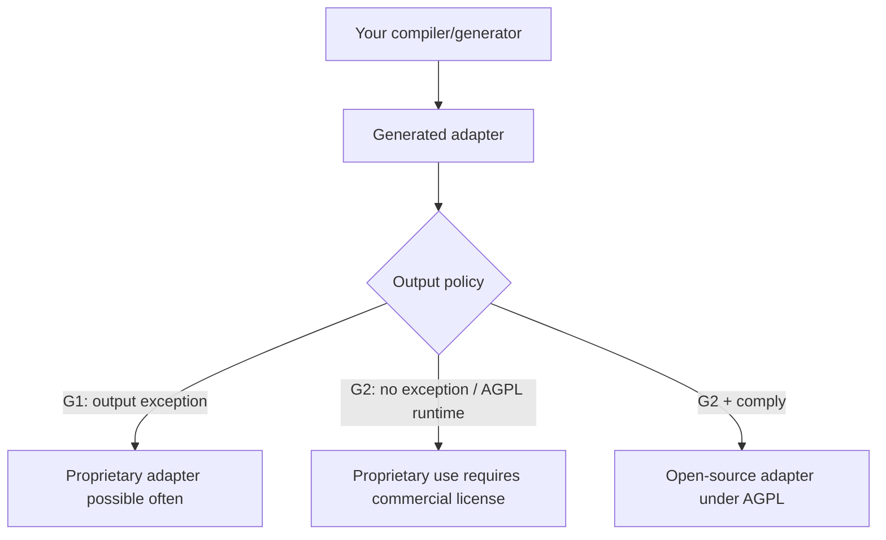

# MCP-AQL Licensing Options (Working Notes)

This document is a discussion aid for deciding how to license the MCP-AQL ecosystem (spec + schema artifacts + tooling + generated adapters + brand/name), while meeting these goals:

1. **Attribution is required** (credit matters).
2. **Improvements flow back** to the ecosystem when people modify/deploy your work.
3. **Commercial option exists** so organizations that won’t comply can still use MCP‑AQL under negotiated terms (including potentially $0 tiers under a revenue threshold).

This is not legal advice. It’s a practical “what usually works in open source licensing” map to support a conversation with counsel and collaborators.

---

## Current MCP-AQL Decisions (As Implemented)

This document contains options and analysis, but MCP-AQL also has **current, implemented choices** in this repo tree. If you are an LLM or contributor implementing policy, treat this section (and Section **17**) as authoritative.

- **Spec repository split licensing**:
  - Spec docs/prose: **CC BY 4.0** (`spec/LICENSE-DOCS`) with scope rules in `spec/LICENSING.md`.
  - Artifacts consumed by tooling (schemas/tests/scripts): **AGPL-3.0** (`spec/LICENSE`).
  - Spec version source of truth: `spec/SPEC_VERSION`.
  - Exact path-based split: see `spec/LICENSING.md`.
- **Code/tooling repos**: **AGPL-3.0** (`LICENSE`) with commercial licensing available (`COMMERCIAL-LICENSE.md`).
- **Commercial license policy (documented)**:
  - Self-serve free commercial license option for organizations under **$1,000,000 USD annual revenue** via self-certification (`COMMERCIAL-LICENSE.md`).
  - Commercial license terms include restrictions such as **no reverse engineering** and **no competitive re-implementation** (`spec/COMMERCIAL-LICENSE-TERMS.md`).
- **Generator output policy (adopted)**:
  - **No output exception** (see Section **17** and `adapter-generator/OUTPUT-POLICY.md`).
  - Generated adapters must emit provenance and include `NOTICE.md`, `COMMERCIAL-LICENSE.md`, and `MCPAQL-PROVENANCE.json` (Section **17**).
- **Attribution artifacts (present)**: `NOTICE.md` and `CITATION.cff` exist across repos and name **Mick Darling**.
- **Trademarks**: `spec/TRADEMARKS.md` (pointer copies in other repos).
- **CLA**: `spec/CLA.md` (pointer copies in other repos).

---

## 1) What are the “things” you can license/control?

You can only enforce terms against things you actually own (copyright/trademark), and only against parties doing acts the law regulates (copying, distributing, making derivatives, public performance/display, etc.).

### High-level ecosystem flow (spec → tools → adapters)



### Assets in the MCP‑AQL ecosystem

- **A. Spec documents**: prose + diagrams + examples.
- **B. Schema artifacts**: JSON Schema, grammar files, IDLs, test vectors, introspection snapshots.
- **C. Tooling code**: interrogator, schema builder, compiler, adapter generator, conformance harness.
- **D. Runtime code**: any libraries or shared runtime the adapter uses at execution time.
- **E. Generated adapter output**: files produced by the compiler/generator.
- **F. The name/brand**: “MCP‑AQL”, logos, compatibility marks (trademark).

Each category behaves differently under common licenses.

---

## 2) The three legal levers that match your three goals

### Goal: “Attribution is required”

You can get attribution in a few different ways:

1. **Copyright notices**: most open source licenses require preservation of copyright and license notices in source and redistributions. This is the baseline.
2. **Dedicated attribution license for docs**: Creative Commons licenses (e.g., **CC BY 4.0**) are designed for documents and have clear attribution requirements.
3. **Trademark policy**: this is the strongest tool for “if you claim compatibility / use our name/logo, you must do it correctly and with attribution, and you must not imply endorsement.”

Practical note: trying to impose “marketing attribution” as a requirement *inside* AGPL/GPL via extra terms can backfire (risk of being treated as an additional restriction). Trademark is the cleanest way to govern the name; CC BY is the cleanest way to require doc attribution.

### Lever map: which tool controls what?



### Goal: “Improvements flow back”

Copyleft only forces sharing when someone uses **your copyrighted work** in a way that creates a derivative work and then distributes or deploys it (AGPL is strong for network deployment).

- Licensing the **spec text** under AGPL does *not* reliably force open-sourcing of independent implementations that merely follow the spec.
- Licensing the **tooling/runtime code** under **AGPL** is far more effective: if they modify and deploy your tooling/runtime as a network service, AGPL obligations trigger.

### Goal: “Commercial option exists”

This is usually done via **dual licensing**:

- Default license: strong copyleft (often AGPL‑3.0).
- Alternative: commercial license with negotiated terms (no source release, private modifications allowed, attribution requirements defined by contract, etc.).

Important constraint: you generally cannot add a “revenue threshold” restriction to an OSI license like AGPL and still call it AGPL. Revenue thresholds work well as **commercial license policy**, not as modifications to AGPL text.

---

## 3) Spec licensing: Creative Commons vs AGPL (what each buys you)

### Option S1: Spec under **CC BY 4.0** (recommended in many standards ecosystems)

**What it does well**
- Clear, explicit **attribution requirement** for document reuse.
- Common and expected for specifications and docs.
- Encourages adoption while preserving credit.

**What it does not do**
- It does not force implementations to be open source.
- It does not impose network copyleft obligations.

**When it fits best**
- You care strongly about credit for the *spec text* itself.
- You expect multiple independent implementations.

### Option S2: Spec under **CC BY‑SA 4.0**

Adds a “share-alike” requirement for derivatives of the spec document itself.

**Pros**
- Spec improvements to the document must stay open (when redistributed).

**Cons**
- Some orgs avoid SA because it can be seen as “viral” for docs.

### Option S3: Spec under **AGPL‑3.0**

**What it does well**
- Strong copyleft for software; if the spec repo also contains AGPL code, that code is covered.

**What it does not do well**
- Spec‑as‑prose is not the typical AGPL target; attribution requirements beyond notice preservation are awkward.
- Doesn’t reliably force open sourcing of clean-room implementations.

**When it fits best**
- The “spec” repo is really a combined **spec + reference code** repo and you want the whole thing copyleft.

### A common hybrid (used by many ecosystems)

- **Spec docs**: CC BY (or CC BY‑SA).
- **Reference implementation + tooling**: AGPL (or GPL/LGPL, depending on goals).
- **Brand/name**: trademark policy.

This cleanly separates “credit for the document” from “copyleft for the code.”

---

## 4) Tooling/runtime licensing: why AGPL is the strongest default

Your architecture includes:

- Interrogator → schema builder → compiler → generated adapter → adapter runs as an MCP server and talks to upstream APIs.

If your goal is “if you modify/deploy our tooling or runtime, you must contribute back,” then AGPL is usually the strongest mainstream OSI copyleft choice because:

- It’s triggered by **network interaction** (not just distribution).
- It’s widely understood by legal teams (even if disliked).
- It pairs cleanly with **commercial dual licensing**.

### “AGPL‑3.0‑only” vs “AGPL‑3.0‑or‑later”

- **AGPL‑3.0‑only**: stable; no automatic upgrades to future versions.
- **AGPL‑3.0‑or‑later**: future‑proof, but some adopters dislike uncertainty.

Many projects pick **only** for clarity, and rely on new releases to change terms if needed.

### Deployment view: wrapper adapter vs native MCP‑AQL endpoints



---

## 5) The generated adapter question (output licensing) — critical decision

The single biggest practical licensing fork in generator ecosystems is:

### Option G1: “Output is NOT automatically copyleft” (output exception)

Some projects explicitly say: the generator is copyleft, but the files it generates are not automatically covered (unless they include substantial copied template code).

**Pros**
- Maximizes adoption; people can generate proprietary adapters without buying a commercial license.

**Cons**
- Weakens your “closed‑source adopters must pay” lever.

### Option G2: “Output IS covered / no exception” (strong pressure toward commercial licenses)

If generated output includes substantial copyrighted template/runtime code (or requires linking to an AGPL runtime), then proprietary distribution/deployment becomes harder without:

- releasing source under AGPL, or
- buying a commercial license.

**Pros**
- Strong lever to prevent “free‑riding closed source adapters at scale.”

**Cons**
- Some organizations will avoid adoption entirely.
- You must be disciplined about what is copied into output vs separated into a runtime library.

### A practical pattern

If you want strong leverage:

- Put meaningful code in an **AGPL runtime** the adapter depends on, or
- Generate adapters that embed substantial “core” code (templates) that are clearly yours.

If you want broad adoption:

- Provide an output exception, or
- Make the runtime permissive/LGPL (but that conflicts with your anti‑free‑rider goal).

---

## 6) Schemas and test vectors: what copyleft does (and does not) enforce

Publishing schema files under AGPL (or other copyleft) generally enforces:

- If someone redistributes the schema (modified or not), they must comply for that schema file.

But it does **not** automatically force:

- an implementation that merely *reads* the schema as data to be open source.

If you want “if you use our schema, you must open your implementation,” copyright licenses alone usually won’t achieve that without also requiring use of your AGPL runtime/tooling.

---

## 7) “Attribution required” in practice: what works reliably

You said attribution is non‑negotiable. The most reliable stack is:

### A. Always require preservation of legal notices

Maintain a `NOTICE` / `NOTICE.md` and require it be preserved in redistributions. This is normal and enforceable across many OSS licenses.

### B. Use trademark to control the name “MCP‑AQL”

Add a `TRADEMARKS.md` policy:

- Allowed: “MCP‑AQL compatible” to describe conformance, with a standard attribution sentence.
- Not allowed without permission: implying endorsement, using logos, naming a fork “MCP‑AQL” in a confusing way, etc.

This is how many ecosystems ensure credit even when implementations are clean-room.

### C. If you want attribution in docs/specs, use CC BY

CC BY has a clear, standard attribution mechanism and is accepted for docs.

---

## 8) Revenue thresholds: where they fit (commercial policy, not AGPL terms)

Your desired rule of thumb:

- If you comply with open terms (including attribution + sharing required code), use is free regardless of revenue.
- If you do **not** comply (no source release where required, or no attribution), you need a commercial license.
- Commercial license price can be **$0 under $1M revenue**, then paid tiers.

This is best implemented as:

- **AGPL** (or CC BY for spec) as the default open license, and
- a **commercial contract** with pricing + revenue threshold + attribution obligations.

Trying to embed revenue thresholds into the open license itself generally makes it non‑standard and often non‑OSI.

---

## 9) Contributor strategy (so you can keep dual licensing viable)

If you accept public contributions and want to keep the ability to offer commercial licenses, you usually need one of:

- **CLA** (Contributor License Agreement) granting you rights to relicense contributions commercially, or
- **copyright assignment**, or
- a tightly controlled contribution process (small trusted group).

Without this, dual licensing becomes legally complicated because contributors own pieces of the copyright.

---

## 10) Recommended “menu” of coherent licensing packages

### Package P1 (common & clean): CC BY spec + AGPL tooling + trademark + commercial

- Spec docs: **CC BY 4.0**
- Tooling/runtime/compiler/interrogator/conformance: **AGPL‑3.0**
- Generated adapters: decide G1 vs G2
- Name/logo: `TRADEMARKS.md`
- Commercial: contract, with your $1M threshold policy

Best for: maximum clarity + strong attribution + strong copyleft where it matters.

### Package P2: AGPL everywhere (simplest, but weaker attribution control)

- Spec + tooling: **AGPL‑3.0**
- Trademark policy still recommended
- Commercial: contract

Best for: simple messaging, but attribution is still better handled by trademark/NOTICE than AGPL add‑ons.

### Package P3 (more adoption, less leverage): CC BY spec + LGPL/Apache tooling

You already dislike permissive licensing; this is listed only as a contrast.

---

## 11) How these packages map to your architecture scenarios

### Scenario A: Clean-room implementation of MCP‑AQL spec

- Spec license (AGPL or CC BY) does not force their implementation to be open source.
- Trademark policy governs how they can use “MCP‑AQL” in marketing and compatibility claims.



### Scenario B: They use your interrogator/compiler/generator as part of their product or service

- If it’s AGPL and they modify/deploy it, AGPL obligations can be triggered.
- If they won’t comply, commercial license covers them.



### Scenario C: They generate an adapter using your compiler

This depends on G1 vs G2:

- With an output exception (G1): they can often keep the generated adapter proprietary (unless it contains substantial copied code).
- Without an exception / with AGPL runtime dependency (G2): proprietary use likely requires commercial licensing.



### Scenario D: They modify the spec text

- Under CC BY‑SA: derivatives of the spec must remain share-alike when redistributed.
- Under AGPL: modifications to the spec repo are under AGPL when distributed (but it’s still “docs under a software license” awkwardness).

---

## 12) Practical repository artifacts (what you can add)

For each repo (as applicable):

- `LICENSE` (AGPL‑3.0 text for code repos; CC BY text for doc repos if chosen)
- `COMMERCIAL-LICENSE.md` (commercial off‑ramp; may include self-serve <$1M option)
- `NOTICE` or `NOTICE.md` (copyright + attribution notice to preserve)
- `TRADEMARKS.md` (name/logo usage policy)
- `CONTRIBUTING.md` + `CLA.md` (if you want contributions while preserving dual licensing)

In the current MCP-AQL repos, these artifacts are implemented (see “Current MCP-AQL Decisions (As Implemented)” above).

---

## 13) Open questions to resolve as a group

1. Should the **spec documents** be CC BY (or CC BY‑SA), or remain AGPL?
2. Should generated adapters be:
   - permissively usable output (output exception), or
   - AGPL‑covered output / require AGPL runtime (strong commercial lever)?
3. What is the minimal attribution statement you want to enforce via trademark/NOTICE?
4. Do you want to allow use of the **name** “MCP‑AQL” for compatibility claims by default, or require registration/permission?
5. Do you want a CLA for contributors now, or keep contributions limited until the policy is finalized?

---

## 14) Threat model: “big company rebrands it and claims credit”

This section focuses on a failure mode you explicitly care about: an organization adopts the *idea/architecture*, reimplements it under a new brand, and you get little/no credit (even if you published first).

### 14.1 What open licenses can and can’t do here

- **Licenses (AGPL/CC) control copying of your expression** (your code, your text, your templates), not the underlying *idea* (“CRUDE endpoints”, “schema-driven dispatch”, “single endpoint mode”, etc.).
- If a company ships a **clean-room reimplementation** (or at least a non-literal reimplementation) under a new name, **copyright licenses alone may not stop it**.
- Where licenses *do* help: if they copy your repos, templates, docs, examples, tests, or substantial code structure, you can enforce preservation of notices and license compliance.

### 14.2 Patents are the main tool for “they can’t just reimplement the idea”

If your primary concern is “they can take the concept and rebrand it”, patents are the lever that targets **functionality/novel method**, not just literal copying.

Practical notes for a patent strategy (discussion aid, not legal advice):

- **File early** (provisional if needed) before public release of key implementation details; treat conference/blog/competition submissions as “public disclosure” unless explicitly confidential.
- Consider claim families around:
  - endpoint reduction patterns (CRUDE, single-endpoint routing),
  - introspection and schema synthesis from APIs,
  - schema-driven dispatch + safety classification enforcement,
  - compilation/generation pipeline producing an adapter with constrained operations,
  - parameter-resolution and field-selection mechanisms that reduce token usage,
  - conformance verification and runtime enforcement mechanisms.
- Use **continuations** strategically if you expect the ecosystem to evolve and you want to pursue later claims as competitors reveal implementations.
- Decide whether you want a **patent pledge** for compliant open-source use while reserving enforcement/commercial terms for noncompliant actors. (This can preserve community goodwill while keeping leverage against “credit stripping”.)

### 14.3 Contracts are how you enforce “you promised attribution”

Your Claude/competition example is a classic gap: publishing first creates evidence, but it doesn’t force attribution unless there’s an enforceable obligation.

When attribution is promised (contest, partnership, pilot), try to ensure it is:

- In **written terms** that are signed/click-accepted and specify:
  - the exact attribution string,
  - where it must appear (docs, UI, marketing, repo),
  - duration, and
  - remedies for breach.
- Not merely in “community guidelines” or informal statements.

If a contest sponsor says “we will attribute” but the terms are vague, enforcement becomes much harder. The best defense is tightening the terms *before* submission, or submitting only what you are willing to have copied without credit.

### 14.4 Make provenance undeniable (for reputational and legal leverage)

Even when it “didn’t work” to prevent copying, a strong provenance package is still valuable for:

- patent novelty timelines,
- copyright enforcement when literal copying occurs,
- and public credibility when you need to correct the record.

Concrete steps:

- Add `CITATION.cff` (canonical “how to cite this”) in the main repos.
- Maintain signed releases/tags and hashes for spec/tooling milestones.
- Keep an internal timeline of disclosures (dates, links, screenshots, submission receipts, emails).
- Keep your copyright notices and a `NOTICE` file consistent and hard to remove without being obvious.

### 14.5 Engineering choices that increase “copying risk” for free riders

You can (legitimately) design the ecosystem so that “just copy it and rename it” is harder without either:

- taking your AGPL code (triggering compliance), or
- reimplementing a lot more work (increasing cost).

Examples:

- Put real value in the **toolchain** (interrogator + compiler + conformance suite + runtime enforcement), not just the high-level concept.
- Keep a clear separation of what is **spec** vs **reference implementation** so that copying the “real thing” is visibly copying your codebase.

### 14.6 What success looks like

Given your threat model, the most realistic “defense-in-depth” target is:

- **Patents** cover the key novel mechanisms (so reimplementation carries legal risk).
- **AGPL + commercial** covers your toolchain/runtime (so using your code requires compliance or a commercial deal).
- **Contracts** cover any “we promise attribution” relationships (so attribution isn’t merely hoped for).
- **Provenance + citation** makes public credit correction easy and credible.

---

## 15) Make it solid: a practical enforcement playbook

This section is a concrete checklist for turning “I can prove I built it first” into leverage that actually works in the real world.

### 15.1 Decide what you’re enforcing (pick your battles)

There are three distinct enforcement targets:

1. **Literal copying of your code/docs/assets** → copyright + license enforcement + DMCA.
2. **Breach of a promise** (contest terms, partnership, pilot) → contract enforcement.
3. **Reimplementation of the method** under a new brand → patents (not copyright).

Trying to use DMCA for (3) usually fails and can backfire. Build a workflow for each target.

### 15.2 Patents: file first, then publish hard

Since you already plan to patent and have counsel:

- File **provisionals** early for each claim family, then publish aggressively after filing.
- Keep a disclosure log with “filed on X date” so you can safely talk publicly without losing priority.
- Ask counsel about a strategy for **continuations** so you can adapt claims as the market reveals implementation details.

### 15.3 Copyright: register, don’t just timestamp

If you want fast, credible leverage in the U.S., ask counsel about:

- **Copyright registration** for the core repos (tooling/runtime/docs) and major releases.
- Registering before infringement (or within relevant windows) can materially improve remedies and negotiation position.

Your transcripts/recordings are excellent evidence of authorship, but registration is what often turns “proof” into “actionable.”

### 15.4 Build “copying canaries” that survive refactors

If you expect copying, make it easy to prove:

- Put a few **unique, non-obvious strings** (canaries) in MCP‑AQL places that tend to get copied verbatim:
  - **adapter generator templates** (headers, default error messages, scaffolding file names),
  - **spec examples** (sample queries/responses that others paste into docs),
  - **test vectors** (golden JSON fixtures),
  - **introspection example outputs** (if you publish them).
- Keep them harmless but distinctive (not just “MCP‑AQL”).
- Track them in a private list so you can quickly search for them in suspicious repos.

If a company copies your code/templates, canaries dramatically reduce debate over “independent creation.”

Concrete MCP‑AQL examples that map to your architecture:

- A deterministic generated file named something like `MCPAQL-PROVENANCE.json` containing a stable canary key/value (e.g., `"mcpaql_canary":"<opaque-string>"`) plus generator metadata.
- A distinctive default error string in the adapter runtime (e.g., `"MCPAQL_E_SAFETY_CLASSIFICATION_REQUIRED"` or another unique identifier), returned when a request lacks safety metadata.
- A distinctive example query block in the spec docs that’s likely to get copy/pasted.

### 15.5 Reduce the “rename-and-run” surface

Engineering choices that increase enforceability:

- Concentrate value in an **AGPL runtime** and a **conformance suite** that’s hard to replace.
- Ensure generated adapters include:
  - `LICENSE` (for your runtime/templates if included),
  - `NOTICE` (attribution/legal notices),
  - a machine-readable provenance file (e.g., `MCPAQL-PROVENANCE.json`) listing generator version + commit hash + schema hash.

This doesn’t stop clean-room reimplementation, but it makes “copy and strip attribution” harder and more obvious.

Concrete MCP‑AQL enforcement hooks that are hard to “accidentally” recreate:

- **Introspection metadata**: include a `meta` section in introspection responses with `mcpaql_spec_version`, `generator_name`, `generator_version`, `generator_commit`, and `schema_fingerprint`.
  - If someone ships your code and strips attribution, these fields tend to survive unless they actively remove them.
  - If someone reimplements clean-room, they won’t match your fingerprints/canaries unless they copied.
- **Schema fingerprinting**: hash normalized schema output (stable order + canonical JSON) and embed the hash in both:
  - the generated adapter, and
  - the schema file itself.
- **Conformance tests**: make the public conformance suite check for:
  - correct CRUDE routing semantics,
  - safety classification enforcement behavior,
  - introspection completeness,
  - *and* presence of provenance metadata fields.

### 15.6 Monitoring: automate discovery instead of relying on luck

Set up continuous discovery for copying signals:

- **GitHub code search** for canary strings and MCP‑AQL-specific identifiers you control, such as:
  - `MCPAQL-PROVENANCE.json`
  - `mcpaql_spec_version`
  - `schema_fingerprint`
  - `MCPAQL_E_` error identifiers
- **Search for verbatim spec phrasing** that tends to get copied:
  - “CRUDE pattern”
  - “single endpoint mode”
  - “schema-driven dispatch”
  - your token reduction table language/structure
- **Package registry monitoring** (npm/PyPI/crates) for your canary strings.
- **Web alerts** for key phrases from the spec/README.

The faster you find copying, the easier enforcement is (less diffusion, fewer downstream forks).

### 15.7 DMCA: use it only for expression copying, and package evidence

DMCA is effective when they copied your expression. Make a “DMCA evidence pack” template:

- Your canonical source URL + commit hash/tag.
- The infringing URL + commit hash.
- A short table: file → copied section → proof (identical snippet / canary hit).
- Screenshots and timestamps.

This lets you act quickly without emotional/uncertain claims.

MCP‑AQL-specific evidence that makes DMCA notices go faster:

- A copied `MCPAQL-PROVENANCE.json` with your generator commit hashes and canary keys.
- Identical adapter scaffolding files produced by your generator (same structure, same headers, same canary strings).
- Identical portions of your spec docs (tables, examples, phrasing) mirrored into their docs.

### 15.8 License enforcement: treat it like a product process

If your repos are AGPL (plus commercial option), have a standard escalation ladder:

1. Friendly compliance email (“here are the obligations; we can help”).
2. Formal notice from counsel.
3. DMCA (if hosted copying is present) and/or litigation decision.
4. Offer commercial terms as the off-ramp (including $0 tiers if that’s your policy).

This is how dual-licensing businesses actually convert “they took it” into either compliance or revenue.

### 15.9 Contests and “we promise attribution”: protect yourself up front

If you submit to a contest or partner program again:

- Treat it as **hostile by default** unless the terms are explicit and enforceable.
- Require terms to specify:
  - attribution text and placement,
  - license scope granted to the sponsor (ideally non-exclusive, limited),
  - confidentiality window if patent filings are pending,
  - what happens to submissions after the contest.

If the sponsor refuses, assume they may copy without credit and submit accordingly (or don’t submit).

### 15.10 Evidence hardening for your existing voice/code catalog

You already have unusually strong provenance (voice recordings + transcripts + code history). To convert that into “hard to dispute” evidence:

- Generate periodic **cryptographic digests** of:
  - repo states (commit hashes are a start, but also include uncommitted work snapshots if relevant),
  - the transcript corpus,
  - and any key design docs.
- Store those digests in at least one **independent timestamped system** (discuss with counsel):
  - signed release artifacts,
  - a transparency log,
  - or any other third-party timestamping mechanism your attorney recommends.

This doesn’t stop copying, but it drastically reduces “we independently invented it” arguments once you’re in a dispute.

---

## 16) Practical implementation checklist (for humans + LLMs)

This section is intentionally concrete: it’s a set of repo changes and design hooks that make MCP‑AQL harder to copy-and-erase, easier to detect when copied, and easier to enforce when attribution is stripped.

### 16.1 Add “must-preserve” attribution artifacts everywhere

Implement in each repo (`spec/`, `adapter-generator/`, `mcpaql-adapter/`, `examples/`, `website/`):

- Add `NOTICE.md` with:
  - copyright owner(s),
  - a short “Attribution” paragraph (exact wording you want),
  - link to the canonical spec site/repo,
  - commercial licensing contact (`licensing@mcpaql.org`).
- Add `CITATION.cff` (so GitHub renders a “Cite this repository” widget).
- Ensure `README.md` has a “License” section that references:
  - `LICENSE`,
  - `COMMERCIAL-LICENSE.md`,
  - and `NOTICE.md`.

Do not rely on README attribution alone; make `NOTICE.md` the canonical thing people must preserve.

### 16.2 Treat removal of attribution as CMI stripping (design for it)

Goal: if someone copies your runtime/templates and removes attribution, that is not just “license noncompliance” but plausibly “removed Copyright Management Information (CMI)”.

Implementation:

- Put a short, consistent CMI header block at the top of:
  - generator templates,
  - runtime source files,
  - generated adapter scaffolding.
- The CMI header should include:
  - project name (MCP‑AQL),
  - copyright owner,
  - license reference,
  - and a canonical URL.

Example header block (adapt wording as desired):

```text
MCP-AQL
Copyright (c) 2025-2026 Mick Darling
Licensed under AGPL-3.0 (see LICENSE) — commercial licenses available (see COMMERCIAL-LICENSE.md)
Canonical: https://mcpaql.org
```

### 16.3 Make adapters carry unambiguous provenance (generated output)

Have the compiler/generator always emit a machine-readable provenance file at the adapter root:

- File: `MCPAQL-PROVENANCE.json`
- Must be included in default `.gitignore` guidance (i.e., do NOT encourage ignoring it).
- Must be included in packaging/distribution (tarball, container, etc.).

Suggested shape:

```json
{
  "format": "mcpaql.provenance.v1",
  "generated_at": "2026-01-13T12:34:56Z",
  "mcpaql_spec_version": "v1.0.0-draft",
  "generator": {
    "name": "mcpaql-adapter-generator",
    "version": "0.1.0",
    "commit": "abcdef1234567890",
    "source_url": "https://github.com/MCPAQL/adapter-generator"
  },
  "schema": {
    "fingerprint": "sha256:...",
    "source": "path/or/url/to/schema.json"
  },
  "canary": {
    "id": "mcpaql_canary_v1",
    "value": "<opaque-string>"
  }
}
```

Notes:
- The canary value should be stable for a given generator release (or stable per customer build, depending on what you want to detect).
- Keep the canary harmless; its value is evidence, not a security control.

### 16.4 Put provenance into runtime behavior (introspection metadata)

Have the adapter’s `introspect` response include a `meta` object with provenance fields.

Example:

```json
{
  "operation": "introspect",
  "result": {
    "meta": {
      "mcpaql_spec_version": "v1.0.0-draft",
      "generator_name": "mcpaql-adapter-generator",
      "generator_version": "0.1.0",
      "generator_commit": "abcdef1234567890",
      "schema_fingerprint": "sha256:..."
    },
    "operations": [ /* ... */ ]
  }
}
```

This gives you three benefits:
- You can detect copying in the wild by searching for these fields/values.
- If someone strips them from your code, it’s a deliberate act, not an accident.
- It’s a conformance surface you can test.

### 16.5 Define a stable schema fingerprint algorithm (so it’s enforceable)

Pick one canonical algorithm and document it (then implement it everywhere):

1. **Normalize** schema JSON:
   - canonical JSON encoding (stable key ordering),
   - remove whitespace,
   - avoid ephemeral fields (timestamps, local paths) in the hashed material.
2. Hash with `SHA-256`.
3. Represent as `sha256:<hex>`.

If your schemas are not JSON, define the equivalent canonicalization (e.g., normalized AST serialization).

### 16.6 Make conformance tests check provenance + safety semantics

In `spec/tests/` (or the appropriate test suite repo), add tests that assert:

- CRUDE routing correctness (already part of spec conformance).
- Safety classification enforcement behaviors (your “red zone” semantics).
- Introspection completeness.
- Presence and correctness of:
  - `result.meta.mcpaql_spec_version`,
  - `result.meta.schema_fingerprint`,
  - and generator identity fields.

This makes it harder for a copy to pass “official conformance” while stripping provenance.

### 16.7 Make “copying signatures” easy to search for

Define and consistently use MCP‑AQL-specific identifiers that are likely to be copied:

- Error code namespace: `MCPAQL_E_*` (e.g., `MCPAQL_E_SAFETY_CLASSIFICATION_REQUIRED`).
- Metadata keys: `mcpaql_spec_version`, `schema_fingerprint`, `generator_commit`.
- File name: `MCPAQL-PROVENANCE.json`.

Then keep a small internal query list you can run periodically:

- GitHub code search for the identifiers above.
- Package registry search for the same identifiers.
- Web search for distinctive spec phrasing and tables.

### 16.8 Decide the “generated adapter” licensing posture explicitly

The implementation must pick one of these and document it clearly:

- **Output exception**: generated adapters can be proprietary by default (max adoption).
- **No exception / runtime dependency**: generated adapters are effectively AGPL unless commercially licensed (max leverage).

If you choose “max leverage”, implement it technically:

- Generated adapters must include or depend on an **AGPL runtime** module that is not trivial to replace without rewriting.

### 16.9 Make the commercial off-ramp real (so enforcement converts)

Implementation tasks:

- Put a short “Commercial licensing” section in each `README.md` pointing to:
  - `COMMERCIAL-LICENSE.md`,
  - and a single canonical email address (`licensing@mcpaql.org`).
- Consider adding a public “commercial licensing overview” page on `website/` (even if pricing is “contact us”), because it helps support “reasonable royalty” arguments and shortens sales cycles.

### 16.10 Keep the spec/docs license separate from the code license

If you decide to use CC BY for the spec text:

- Make it explicit in `spec/`:
  - `LICENSE` for the repo’s code (if any),
  - a separate `LICENSE-DOCS` (or similar) for spec prose,
  - and clear labeling in `spec/README.md`.

This avoids accidentally mixing a doc license into the toolchain/code.

---

## 17) Policy to implement: toolchain + generated adapter licensing (LLM-ready)

This section is a **normative policy spec** for the MCP‑AQL toolchain and generated adapters. It is written so another LLM can implement it directly in the generator/compiler and related repos.

### 17.1 Goals (what this policy must accomplish)

1. **Default path**: anyone can use MCP‑AQL tooling under open terms (AGPL for code; CC BY for spec docs as applicable).
2. **Closed-source path**: organizations that do not want to comply with AGPL obligations should be able to obtain a **commercial license easily** (low-friction, “email us / simple form”).
3. **Deterrence**: the easiest way to ship adapters is to use the official toolchain; bypassing it (clean-room reimplementation) should be meaningfully more work.
4. **Attribution stickiness**: when the toolchain is used, generated output must carry clear, durable attribution/notice artifacts and machine-readable provenance that is hard to remove “by accident”.

### 17.2 Definitions

- **Toolchain**: interrogator + schema builder + compiler/adapter generator + any runtime libraries required by generated adapters.
- **Generated adapter**: the multi-file wrapper produced by the compiler/generator that runs as an MCP server (MCP‑AQL endpoints) and as an MCP client (upstream API binding).
- **Output exception**: a license statement that grants permission to use generated output under terms other than the generator’s copyleft.

### 17.3 License posture (explicit decisions)

1. Toolchain code is licensed under **AGPL-3.0** (see `LICENSE`).
2. **No output exception is granted.**
   - The project will not publish an “output exception” that automatically permits proprietary use of generated adapters.
3. Commercial licenses are available as the off‑ramp for closed-source use (see `COMMERCIAL-LICENSE.md` and contact `licensing@mcpaql.org`).

Notes:
- This policy does **not** attempt to modify AGPL terms (no revenue thresholds inside open licensing text).
- Any revenue thresholds or “free commercial license under $X revenue” rules belong in the **commercial contract** and can be described (non-binding) in `COMMERCIAL-LICENSE.md`.
  - Current intent: a self-serve free commercial license option for organizations under $1,000,000 USD in annual revenue via self-certification.

### 17.4 Technical requirements (what the generator must emit)

When the toolchain generates an adapter, the output **MUST** include the following files at the adapter root (or a documented equivalent path):

1. `LICENSE`:
   - If the generated adapter includes or vendors MCP‑AQL runtime/template code, this file MUST contain the applicable open license text (AGPL-3.0) for that included code.
2. `NOTICE.md`:
   - MUST include an attribution statement and canonical links (see template below).
   - MUST state that commercial licensing is available and point to the contact address.
3. `COMMERCIAL-LICENSE.md`:
   - MUST be included as a short pointer (not full terms) so downstream users can immediately find the off‑ramp.
4. `MCPAQL-PROVENANCE.json`:
   - MUST include generator identity and build metadata (commit hash, version, source URL).
   - MUST include a stable `schema_fingerprint`.
   - MUST include a `canary` section (see below).

Generator identity defaults (so implementations are consistent):

- `generator.name`: `mcpaql-adapter-generator`
- `generator.source_url`: `https://github.com/MCPAQL/adapter-generator`
- `generator.commit`: git commit of the generator used for the build.
- `generator.version`: prefer a semver tag if present, else `0.0.0+<short-commit>`.

Spec version source of truth:

- Read the current spec version from `spec/SPEC_VERSION` in the `spec` repo (example value: `v1.0.0-draft`).
- Use that value for:
  - `mcpaql_spec_version` in `MCPAQL-PROVENANCE.json`, and
  - `result.meta.mcpaql_spec_version` in introspection.

The generator **SHOULD** also:
- include `CITATION.cff` in generated output (optional but helpful), and
- include a `LICENSING.md` (short human-friendly summary of what’s included and why).

### 17.5 Runtime dependency requirement (what makes this enforceable)

To achieve the desired “use our toolchain or pay/comply” outcome, generated adapters MUST, by default, be built in a way that they:

- **depend on an MCP‑AQL runtime module** that is part of the toolchain and is licensed under AGPL-3.0, OR
- embed substantial MCP‑AQL template/runtime code that is clearly copyrighted by the project.

Implementation guidance:
- Prefer a runtime module import/dependency (cleaner engineering) over copying large template blobs into every file.
- The runtime should implement core behaviors that are hard to “stub out” without rewriting:
  - CRUDE routing,
  - safety classification enforcement (your “red zone” semantics),
  - introspection meta emission,
  - schema fingerprint verification.

### 17.6 Required behavior surfaces (what the adapter must expose)

To make copying detectable and attribution durable, adapters produced by the toolchain MUST:

1. Expose provenance in introspection:
   - `introspect` responses MUST include a `meta` object with:
     - `mcpaql_spec_version`
     - `generator_name`
     - `generator_version`
     - `generator_commit`
     - `schema_fingerprint`
2. Use a stable error namespace:
   - Safety and policy-related errors SHOULD use `MCPAQL_E_*` identifiers.

### 17.7 Canary policy (copy detection, not security)

The generator MUST include a `canary` in `MCPAQL-PROVENANCE.json`.

Policy:
- Canary value MUST be non-obvious and stable for a given generator release (or stable per “distribution channel”).
- Canary value MUST NOT be a secret credential; it is only an identifier for copy detection.
- The project should keep an internal mapping of canary values to generator releases for later verification.

### 17.8 Templates (drop-in text for generated artifacts)

`NOTICE.md` template (generated adapter):

```markdown
# NOTICE

This adapter was generated by the MCP-AQL toolchain.

MCP-AQL (Model Context Protocol – Advanced Agent API Adapter Query Language)
Copyright (c) 2025-2026 Mick Darling.

You must preserve this notice and other copyright and license notices in any redistribution.

Canonical: https://mcpaql.org
Toolchain source: https://github.com/MCPAQL

Commercial licenses are available: licensing@mcpaql.org (see COMMERCIAL-LICENSE.md).
```

`COMMERCIAL-LICENSE.md` template (generated adapter):

```markdown
# Commercial Licensing

This adapter includes MCP-AQL toolchain/runtime components licensed under AGPL-3.0. See LICENSE.

Commercial licenses are available for organizations that want to use, modify, or distribute this adapter without AGPL obligations.

If your organization has less than $1,000,000 USD in annual revenue, you may use the self-serve free commercial license option by self-certifying in writing in your own records (no correspondence required).

Contact: licensing@mcpaql.org
```

### 17.9 Non-goals (what this policy is not trying to do)

- This policy cannot prevent a true clean-room reimplementation of the idea under a new brand.
- This policy is designed to:
  - make copying your actual toolchain/runtime/templates easy to detect and enforce, and
  - make the commercial-license off‑ramp obvious and low friction.

### 17.10 Schema fingerprinting (canonical definition to implement)

The `schema_fingerprint` MUST be computed using a stable canonicalization so that:
- the same schema content yields the same fingerprint across platforms/languages, and
- the fingerprint does not change due to whitespace, key ordering, or formatting differences.

Definition:

1. Let `schema` be the schema document in JSON form.
2. Remove any explicitly non-semantic, build-specific fields (if present), such as:
   - `generated_at`, `generator`, `provenance`, or similar build metadata fields embedded inside the schema document.
3. Canonicalize the JSON using the JSON Canonicalization Scheme (JCS, RFC 8785) or an equivalent stable canonical JSON serializer:
   - stable key ordering,
   - UTF-8 encoding,
   - no insignificant whitespace differences.
4. Compute SHA-256 over the canonicalized UTF-8 bytes.
5. Represent the fingerprint as `sha256:<hex>`.

The canonicalization requirement is the important part; the exact library used can vary by language as long as it produces the same canonical bytes.
